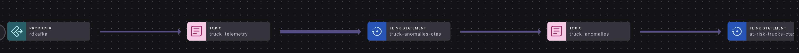

# Predictive Maintenance — Streaming Agent for a Trucking Fleet

An end-to-end Confluent Cloud demo that catches mechanical failures *before they happen* on a commercial trucking fleet and autonomously dispatches each at-risk truck to a service center — all in Flink SQL, with no external orchestration.

The pipeline exercises every Flink AI primitive in the hackathon rubric:

| Capability | How it's used here |
|---|---|
| **Flink SQL stream processing** | Windowed aggregation (TUMBLE), per-truck OVER partitioning, multi-CTE UNION ALL fan-out, CREATE TABLE AS continuous jobs, regex parsing of LLM output |
| **Built-in ML Functions** | `ML_DETECT_ANOMALIES` fanned across 6 sensor signals per truck |
| **Flink AI Model Inference** | `ML_PREDICT` against `llm_textgen_model` to produce structured diagnoses (severity + likely_cause + recommended_action) |
| **Streaming Agents** | `CREATE TOOL`, `CREATE AGENT`, `AI_RUN_AGENT` against an MCP server for autonomous shop dispatch via `http_get` / `http_post` |

## Project Lineage



## The pipeline

```
shadowtraffic (data-gen/)
        │  IoT telemetry
        ▼
Kafka topic: truck_telemetry  (Avro, 6 sensors × 10 trucks)
        │
        ▼
truck_telemetry table                    [01_create_table.sql]
        │
        ▼  ML_DETECT_ANOMALIES × 6 signals
truck_anomalies                          [04_multi_signal_anomalies.sql]
        │
        ▼  multi-signal escalation
at_risk_trucks                           [05_at_risk_trucks.sql]
        │
        ▼  ML_PREDICT(llm_textgen_model)        ← Flink AI Model Inference
at_risk_trucks_diagnosed                 [06_diagnose_with_llm.sql]
        │
        ▼  AI_RUN_AGENT(maintenance_dispatch_agent)  ← Streaming Agent
completed_actions                        [08_run_agent.sql]
   (dispatch_summary, dispatch_json, api_response)
```

## Failure scenarios in the data

The generator emits 10 trucks, every ~1.5–3 seconds, across these signals:

| Signal | Healthy baseline | Failure pattern |
|---|---|---|
| `engine_temp_c` | 88 °C | Slow rise → cooling system / EGT precursor |
| `oil_pressure_psi` | 52 psi | Slow drop → pump or seal degradation |
| `vibration_g` | 0.32 g | Slow rise → wheel-bearing precursor |
| `tire_psi_avg` | 102 psi | Slow drop → slow leak |
| `brake_pad_mm` | 13 mm | Slow drop → pad wear |
| `fuel_efficiency_mpg` | 7.2 mpg | Slow drop → secondary symptom |

- **6 healthy trucks** (`TRK-101`, `TRK-289`, `TRK-301`, `TRK-503`, `TRK-612`, `TRK-744`) stay at baseline.
- **4 degrading trucks** (`TRK-112`, `TRK-207`, `TRK-356`, `TRK-418`) emit clean baselines during the 24 h historical replay (training data for `ML_DETECT_ANOMALIES`), then drift toward failure once real-time playback begins.

## Prerequisites

This demo depends on Flink AI primitives that the parent project's `terraform/core` and `terraform/lab3-agentic-fleet-management` modules already provision. The simplest setup:

```bash
# from the parent quickstart-streaming-agents repo
uv run deploy   # select lab3
```

That gives you:

- A Confluent Cloud Kafka cluster + Schema Registry + Flink compute pool
- The `llm-textgen-connection` and the `llm_textgen_model` Flink model (Bedrock or Azure OpenAI)
- The `remote-mcp-connection` and the `remote_mcp_model` Flink model bound to it

You'll also need:

- **Docker**
- Kafka and Schema Registry credentials exported as env vars (see step 1 below)

## Project layout

```
predictive-maintenance/
├── data-gen/
│   ├── root.json
│   ├── run.sh
│   ├── connections/truck-telemetry.json
│   ├── generators/
│   │   ├── base-telemetry.json
│   │   ├── healthy-telemetry.json
│   │   └── degrading-telemetry.json
│   ├── trucks/{all,healthy,degrading}-trucks.json
│   └── functions/advance_time.py
└── flink-sql/
    ├── 01_create_table.sql              # source table + watermark
    ├── 02_eda_engine_temp.sql           # interactive viz query
    ├── 03_engine_temp_anomalies.sql     # single-signal continuous job
    ├── 04_multi_signal_anomalies.sql    # truck_anomalies (6 signals UNIONed)
    ├── 05_at_risk_trucks.sql            # multi-signal escalation
    ├── 06_diagnose_with_llm.sql         # ML_PREDICT diagnosis  (AI Model Inference)
    ├── 07_create_dispatch_agent.sql     # CREATE TOOL + CREATE AGENT  (Streaming Agents)
    └── 08_run_agent.sql                 # AI_RUN_AGENT -> completed_actions
```

## Run it

**1. Export Kafka + Schema Registry credentials:**

```bash
export KAFKA_BOOTSTRAP_SERVERS=...
export KAFKA_API_KEY=...
export KAFKA_API_SECRET=...
export SCHEMA_REGISTRY_URL=...
export SCHEMA_REGISTRY_API_KEY=...
export SCHEMA_REGISTRY_API_SECRET=...
```

These are the same values used by the parent project's `credentials.env`.

**2. Create the topic:**

```bash
confluent kafka topic create truck_telemetry --partitions 6
```

**3. Start the data generator:**

```bash
cd data-gen
./run.sh
```

~24 hours of baseline telemetry replays in seconds (training data for `ML_DETECT_ANOMALIES`), then real-time playback begins at ~2 s per reading. Degrading trucks start drifting from this point.

**4. Run the SQL statements in order**, pasting each file into its own SQL workspace cell in the Confluent Cloud UI:

| Step | File | What it does |
|---|---|---|
| 1 | `01_create_table.sql` | Source table over the Kafka topic |
| 2 | `02_eda_engine_temp.sql` | Interactive — click the `anomaly_result` graph to *see* the drift breach the upper bound |
| 3 | `04_multi_signal_anomalies.sql` | Continuous job — every signal anomaly lands in `truck_anomalies` |
| 4 | `05_at_risk_trucks.sql` | Continuous job — trucks with ≥2 signals tripped land in `at_risk_trucks` |
| 5 | `06_diagnose_with_llm.sql` | LLM diagnosis via `ML_PREDICT` → `at_risk_trucks_diagnosed` |
| 6 | `07_create_dispatch_agent.sql` | Declare the MCP tool + streaming agent |
| 7 | `08_run_agent.sql` | `AI_RUN_AGENT` fires on every new diagnosis → `completed_actions` |

(File `03_engine_temp_anomalies.sql` is a single-signal version useful for debugging; the multi-signal `04` supersedes it in the production flow.)

**5. Watch the agent work:**

```sql
SELECT
    truck_id,
    severity,
    likely_cause,
    dispatch_summary,
    dispatch_json,
    api_response
FROM completed_actions;
```

Within ~3–5 minutes of real-time playback starting, you should see rows for `TRK-112`, `TRK-207`, `TRK-356`, `TRK-418` — each with an LLM-generated diagnosis, an agent-built dispatch JSON, and a (mocked) POST response.

## How each AI step contributes

**`ML_DETECT_ANOMALIES` (built-in ML function).** Trains a per-truck-per-signal forecasting model on the historical replay, then flags real-time readings outside the confidence band. Fanned across 6 signals via UNION ALL so a single agent can reason about multi-symptom failure modes (rising vibration + rising temp = different problem than rising temp alone).

**`ML_PREDICT` against `llm_textgen_model` (AI Model Inference).** Takes the structured `at_risk_trucks` row and produces a structured response — `SEVERITY:`, `LIKELY_CAUSE:`, `RECOMMENDED_ACTION:` — parsed back into typed columns with `REGEXP_EXTRACT`. The LLM does what rules can't: it weighs combinations of symptoms against domain knowledge.

**`CREATE AGENT` + `AI_RUN_AGENT` (Streaming Agents).** The diagnosis isn't the end — the agent then calls real tools. `http_get` to look up nearby service centers, `http_post` to actually file the dispatch. Severity drives behavior (CRITICAL → URGENT routing within 50 miles; LOW → monitor only). Closed-loop, no human in the loop.

## How the drift simulation works

Each sensor value in `base-telemetry.json` is computed as:

```
sensor_value = baseline + drift_rate * elapsed_minutes + noise
```

where `elapsed_minutes = max(0, (event_ts - sim_start) / 60000)`.

- During the **historical replay**, `event_ts < sim_start` → `elapsed_minutes = 0` → every truck emits clean baseline values. This is what `ML_DETECT_ANOMALIES` trains on.
- Once playback switches to **real-time**, `event_ts = now` → `elapsed_minutes` climbs. Healthy trucks set drift rates to 0 (no movement); degrading trucks set positive/negative rates per sensor so values walk outside the learned band.

Tuning knobs:
- Drift rates: `generators/degrading-telemetry.json` (`egtDriftRate`, `oilDriftRate`, etc.)
- Window size: `INTERVAL '1' MINUTE` in the Flink SQL
- Model sensitivity: `minTrainingSize` (200), `confidencePercentage` (99.9) in the `JSON_OBJECT`

## Cleanup

```sql
DROP TABLE completed_actions;
DROP TABLE at_risk_trucks_diagnosed;
DROP TABLE at_risk_trucks;
DROP TABLE truck_anomalies;
DROP TABLE engine_temp_anomalies;
DROP AGENT maintenance_dispatch_agent;
DROP TOOL maintenance_remote_mcp;
DROP TABLE truck_telemetry;
```

```bash
confluent kafka topic delete truck_telemetry
docker stop $(docker ps -q --filter ancestor=shadowtraffic/shadowtraffic:1.14.1)
```
